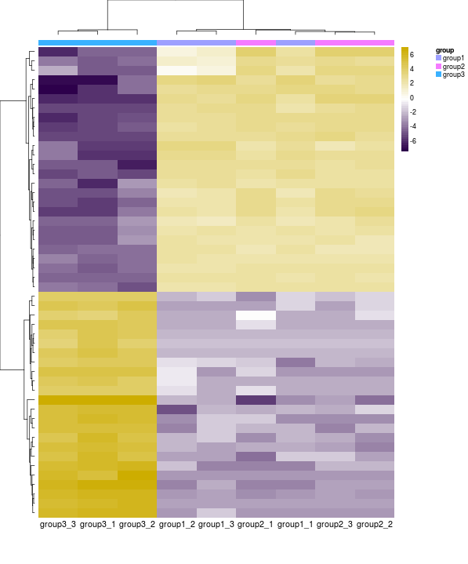
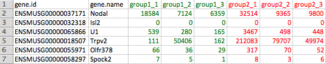
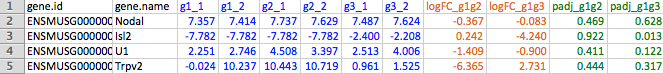

**The START app allows users to visualize RNA-seq data starting with count data.**

- *Explore* the app's features with the example data set pre-loaded by clicking on the tabs above.
- *Upload* your data in the "Input Data" tab.

####  Features

*Visualize your data:*

- clustering (PCA plots, heatmaps)
- group comparisons (scatterplots, volcano plots)
- gene-level boxplots of expression values

####  Data Format

- Must be a .CSV *comma-separated-value* file (you may export from Excel).
- File must have a header row.
- First/Left-hand column(s) must be gene identifiers.
- Format expression column names as `GROUPNAME_REPLICATE#`, e.g. `Treat_1, Treat_2, Treat_3, Control_1, Control_2, High_1, High_2`

**Count or Expression Data**
- Each row denotes a gene, each column denotes a sample.

**Analyzed Data**
- Each row denotes a gene, each column denotes a sample.
- Additional columns provide Fold Changes and P-values

####  *TIP*: Save Data for Future Upload

After uploading your data to START, click red button

to download an .RData file to upload your data to START with one click.

Next time use the "Input Data" tab --> "START RData file" option.

####  More Help and Info

Additional help information and more detailed instructions are provided under the "Instructions" tab.

#### App Info
The START app has been developed by Jessica Minnier, Jiri Sklenar, Anthony Paul Barnes, and Jonathan Nelson
of Oregon Health & Science University, Knight Cardiovascular Institute and School of Public Health.

The source code of START is available on [Github](https://github.com/jminnier/STARTapp).

We would appreciate reports of any issues with the app via the issues option of 
[Github](https://github.com/jminnier/STARTapp) or by emailing start.app.help-at-gmail.com.

